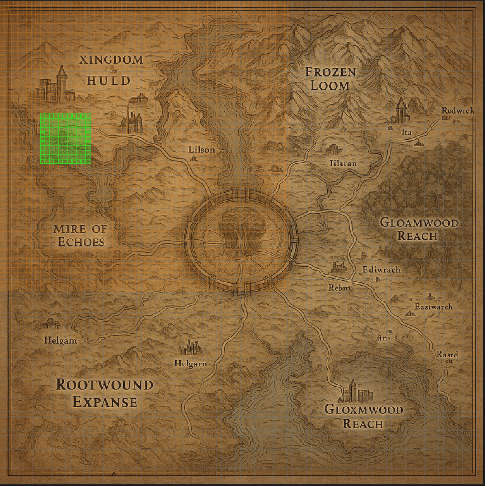

# Grid System & Coordinate System Documentation

## Overview

The map editor uses a **cell-based grid system** where maps are divided into a fixed number of cells. The grid is **always aligned to cell boundaries** and uses the map's `baseCellSize` configuration, not a global grid size.

### Issue at 60% Zoom

The grid was previously misaligned at non-100% zoom levels due to:
1. Using store's `gridSize` (10) instead of map's `baseCellSize` (16)
2. Manual zoom scaling conflicting with Konva's automatic scaling

**Before Fix:**


**After Fix:**
- Grid lines now align perfectly with cell boundaries at all zoom levels
- Cells fit exactly within grid squares
- Region highlighting aligns with grid

## Standard Cell Counts

**Cell count depends on image size, but cell size in Unreal meters is what matters:**

| Map Level | baseCellSize | Example Image | Cells Per Side | Cell Size (Unreal) |
|-----------|--------------|---------------|----------------|-------------------|
| **World** | 16px | 4096×4096px | 256 cells | ~47m × 47m |
| **World** | 16px | 1024×1024px | 64 cells | ~47m × 47m (same!) |
| **Town** | 10px | 2048×2048px | 204 cells | ~9.8m × 9.8m |
| **Interior** | 8px | 1024×1024px | 128 cells | ~3.9m × 3.9m |
| **Small Interior** | 5px | 512×512px | 102 cells | ~0.98m × 0.98m |

**Key Principles:**
1. **Image sizes are flexible** - Images are just visual reference, they get stretched to fit the coordinate config
2. **Cell count = `Math.floor(imageWidth / baseCellSize) × Math.floor(imageHeight / baseCellSize)`**
3. **Cell size in Unreal meters** is the source of truth - calculated as `baseCellSize × (unrealWidth / imageWidth)`
4. **Same baseCellSize = same cell size in meters** - regardless of image dimensions

**Example:**
- World map with 4096×4096px image: 256×256 cells, each cell = 47m × 47m
- World map with 1024×1024px image: 64×64 cells, each cell = 47m × 47m (same cell size!)
- The image gets stretched to match the config, so cell size in Unreal meters stays constant

## How the Grid System Works

### 1. Cell Coordinates

Cells are identified by integer coordinates `(cellX, cellY)` starting from `(0, 0)` in the top-left corner:

```typescript
interface CellCoordinates {
  cellX: number;  // 0 to maxCellsX - 1
  cellY: number;  // 0 to maxCellsY - 1
}
```

**Example (World Map):**
- Cell `(0, 0)` = top-left corner (pixel 0, 0)
- Cell `(15, 15)` = pixel position (240, 240) = (15 × 16, 15 × 16)
- Cell `(255, 255)` = bottom-right corner (pixel 4080, 4080)

### 2. Pixel to Cell Conversion

```typescript
// lib/utils/coordinateSystem.ts
export function pixelToCell(
  pixel: PixelCoordinates,
  config: CoordinateSystemConfig,
  zoom: number = 1  // Zoom doesn't affect cell calculation
): CellCoordinates {
  const cellSize = config.baseCellSize;  // Always use baseCellSize
  return {
    cellX: Math.floor(pixel.x / cellSize),
    cellY: Math.floor(pixel.y / cellSize),
  };
}
```

**Important:** Zoom does NOT affect cell calculations. A pixel at position (240, 240) is always cell (15, 15) regardless of zoom level.

### 3. Cell to Pixel Conversion

```typescript
export function cellToPixel(
  cell: CellCoordinates,
  config: CoordinateSystemConfig,
  zoom: number = 1  // Zoom doesn't affect cell position
): PixelCoordinates {
  const cellSize = config.baseCellSize;  // Always use baseCellSize
  return {
    x: cell.cellX * cellSize,
    y: cell.cellY * cellSize,
  };
}
```

**Important:** Cell positions are absolute. Cell (15, 15) is always at pixel (240, 240), regardless of zoom.

### 4. Grid Rendering

The grid should be drawn at cell boundaries using `baseCellSize`:

```typescript
// Grid lines should be drawn at:
// x = 0, baseCellSize, 2*baseCellSize, 3*baseCellSize, ...
// y = 0, baseCellSize, 2*baseCellSize, 3*baseCellSize, ...
```

**Current Bug:** The grid uses `gridSize` from the store (default 10) instead of the map's `baseCellSize` (16 for world maps), causing misalignment.

## Region System

### Base Region Concept

The **base region** represents the region being edited in the current map. When you load a nested map:

1. **Parent region becomes base region** - If "tet" has a map, loading that map makes "tet" the base region
2. **Base region covers entire map** - It represents the full area being edited
3. **Other regions are created on top** - You create more regions within the base region

**Example Flow:**
```
1. World Map
   └─ Region: "tet" (11×11 cells, ~517m × 517m)

2. Create nested map for "tet"
   └─ Map: "tet-map" (nested from "tet" region)
   └─ "tet" becomes base region when you load "tet-map"

3. Load "tet-map"
   └─ "tet" is now the base region (covers entire "tet-map")
   └─ Create new regions on "tet-map":
      ├─ Region: "shop" (20×20 cells, ~196m × 196m)
      ├─ Region: "home" (15×15 cells, ~147m × 147m)
      └─ Region: "dungeon" (30×30 cells, ~294m × 294m)

4. Create nested map for "shop"
   └─ Map: "shop-map" (nested from "shop" region)
   └─ "shop" becomes base region when you load "shop-map"

5. Load "shop-map"
   └─ "shop" is now the base region (covers entire "shop-map")
   └─ Create new regions on "shop-map":
      ├─ Region: "counter" (5×5 cells, ~19.5m × 19.5m)
      └─ Region: "storage" (8×8 cells, ~31.2m × 31.2m)
```

**Key Points:**
- Base region is identified by `name === "Base Region"` OR it's the region that the nested map was created from
- Base region covers all cells from `(0, 0)` to `(maxCellsX-1, maxCellsY-1)`
- Each nested level gets more granular (smaller Unreal units per cell)

### Child Regions

Child regions are subsets of the base region (or other parent regions). They inherit environment properties from their parent.

**Example from database:**
```json
{
  "id": "region-1765380377118",
  "map_id": "world_region-map",
  "parent_region_id": "world_region-region",  // Parent is base region
  "name": "tet",
  "cells": "[{\"cellX\":9,\"cellY\":25},{\"cellX\":10,\"cellY\":25},...,{\"cellX\":19,\"cellY\":35}]"
}
```

**Region Details:**
- **Bounds:** X: 9-19 (11 cells), Y: 25-35 (11 cells)
- **Total cells:** 11 × 11 = 121 cells
- **Parent:** Base region (`world_region-region`)
- **Inheritance:** Inherits environment from base region unless overridden

**Inheritance Rules:**
1. Child regions inherit `environmentId` from parent if not set
2. Child regions can override parent's environment
3. Base region is the root - it has no parent
4. Regions can be nested: Base → Child → Grandchild

## Zoom and Display

### How Zoom Affects Display

1. **Cell positions are absolute** - Cell (15, 15) is always at pixel (240, 240)
2. **Zoom affects visual scale only** - At 60% zoom, the cell appears smaller but is still at the same pixel position
3. **Grid lines must align with cell boundaries** - Grid should be drawn at `baseCellSize` intervals

### Current Implementation Issues

**Problem 1: Grid uses wrong size**
```typescript
// MapCanvas.tsx (WRONG)
gridSize={useMapEditorStore.getState().gridSize}  // Uses store's gridSize (10)

// Should be:
gridSize={selectedMap.coordinateConfig.baseCellSize}  // Use map's baseCellSize (16)
```

**Problem 2: Grid doesn't account for zoom properly**
- Grid lines are drawn at fixed positions (0, gridSize, 2*gridSize...)
- But cells are scaled by zoom in CellSelectionLayer
- Result: Grid and cells don't align at non-100% zoom

**Problem 3: Cell selection layer scales cells**
```typescript
// CellSelectionLayer.tsx
x: pixel.x * zoom,  // Scales position with zoom
displayCellSize = cellSize * zoom,  // Scales size with zoom
```

This causes cells to appear at different positions than the grid lines when zoomed.

## Code Architecture

### Key Files

1. **`lib/utils/coordinateSystem.ts`**
   - Core coordinate conversion functions
   - `pixelToCell()` - Convert pixel to cell (zoom-independent)
   - `cellToPixel()` - Convert cell to pixel (zoom-independent)
   - `getStandardConfig()` - Get standard config for map level

2. **`components/environment/GridLayer.tsx`**
   - Renders grid lines
   - **BUG:** Uses store's `gridSize` instead of map's `baseCellSize`
   - **BUG:** Grid lines don't account for zoom properly

3. **`components/environment/CellSelectionLayer.tsx`**
   - Renders cell selections and regions
   - Scales cells by zoom (causes misalignment)
   - Uses `baseCellSize` from config (correct)

4. **`components/environment/MapCanvas.tsx`**
   - Main canvas component
   - Manages zoom/pan
   - **BUG:** Passes wrong `gridSize` to GridLayer

### Standard Configurations

```typescript
// lib/utils/coordinateSystem.ts
export function getStandardConfig(level: MapLevel): CoordinateSystemConfig {
  const standards = {
    [MapLevel.World]: {
      imageWidth: 4096,
      imageHeight: 4096,
      unrealWidth: 12000,   // 12km
      unrealHeight: 12000,
      baseCellSize: 16,     // 16 pixels per cell → 256×256 cells
      zoneSize: 16,         // 16 cells per zone
    },
    [MapLevel.Town]: {
      imageWidth: 2048,
      imageHeight: 2048,
      unrealWidth: 2000,    // 2km
      unrealHeight: 2000,
      baseCellSize: 10,     // 10 pixels per cell → 204×204 cells
      zoneSize: 10,
    },
    // ... etc
  };
}
```

## Fixing the Grid Bug

### Root Cause

1. **Grid used wrong size:** The grid was drawn using the store's `gridSize` (default 10) instead of the map's `baseCellSize` (16 for world maps)
2. **Cells manually scaled:** Cells were being manually scaled by zoom in `CellSelectionLayer`, but Konva Stage already handles zoom via `scaleX/scaleY`, causing double-scaling and misalignment

### Solution (IMPLEMENTED)

1. **Use `baseCellSize` from map config** for grid rendering
2. **Remove manual zoom scaling** - Let Konva Stage handle zoom transformation automatically
3. **Draw everything at absolute positions** - Grid lines and cells at absolute pixel positions, Konva scales them

### Implementation

```typescript
// MapCanvas.tsx - Fixed: Use baseCellSize
<GridLayer
  width={selectedMap.coordinateConfig.imageWidth}
  height={selectedMap.coordinateConfig.imageHeight}
  gridSize={selectedMap.coordinateConfig.baseCellSize}  // ✅ Now uses baseCellSize (16 for world)
  zoom={zoom}
/>

// CellSelectionLayer.tsx - Fixed: Remove manual scaling
// Before (WRONG):
x: pixel.x * zoom,  // ❌ Manual scaling
width: cellSize * zoom,  // ❌ Manual scaling

// After (CORRECT):
x: pixel.x,  // ✅ Absolute position - Konva Stage scales it
width: cellSize,  // ✅ Absolute size - Konva Stage scales it

// GridLayer.tsx - Grid lines at absolute positions
// Grid lines drawn at: 0, baseCellSize, 2*baseCellSize, ...
// Konva Stage's scaleX/scaleY handles zoom transformation
for (let x = 0; x <= width; x += gridSize) {  // gridSize = baseCellSize
  // Draw line at absolute position x
  // Konva automatically scales it based on Stage's scaleX/scaleY
}
```

### How Konva Stage Handles Zoom

```typescript
// MapCanvas.tsx
<Stage
  scaleX={selectionMode === "cell" ? 1.0 : zoom}  // Konva scales everything
  scaleY={selectionMode === "cell" ? 1.0 : zoom}  // Konva scales everything
  x={panX}
  y={panY}
>
  <Layer>
    {/* All children are automatically scaled by Konva */}
    <GridLayer ... />  {/* Grid lines at absolute positions */}
    <CellSelectionLayer ... />  {/* Cells at absolute positions */}
  </Layer>
</Stage>
```

**Key Insight:** Konva Stage's `scaleX` and `scaleY` transform all children automatically. We should draw everything at absolute positions and let Konva handle the scaling.

## Testing Requirements

### Test Cases

1. **Grid Alignment at 100% Zoom**
   - Grid lines should align perfectly with cell boundaries
   - Cells should fit exactly within grid squares
   - ✅ **Test:** `lib/utils/__tests__/coordinateSystem.test.ts`

2. **Grid Alignment at 60% Zoom**
   - Grid lines should still align with cell boundaries
   - Cells should fit exactly within grid squares (scaled by Konva)
   - **Visual Test:** See `map_with_bad_grid_at_60_zoom.png` (before fix)

3. **Grid Alignment at 200% Zoom**
   - Grid lines should still align with cell boundaries
   - Cells should fit exactly within grid squares (scaled by Konva)

4. **Cell Selection Accuracy**
   - Clicking on a cell should select the correct cell
   - Selection should match grid boundaries
   - **Test:** Click at pixel (240, 240) → should select cell (15, 15) for world map

5. **Region Highlighting**
   - Regions should highlight correctly at all zoom levels
   - Region boundaries should align with grid lines
   - Base region should be visible when selected
   - Child regions should be visible and properly highlighted

### Test Data

**From Database:**
- **Base region:** `world_region-region`
  - Name: "Base Region"
  - Cells: 0-63 in X, 0-63 in Y (64×64 = 4,096 cells)
  - Note: This suggests a 1024×1024px image with baseCellSize=16, or a different configuration
  
- **Child region:** `region-1765380377118`
  - Name: "tet"
  - Parent: `world_region-region` (base region)
  - Cells: X: 9-19 (11 cells), Y: 25-35 (11 cells)
  - Total: 11 × 11 = 121 cells

### Automated Tests

Run tests with:
```bash
npm test -- lib/utils/__tests__/coordinateSystem.test.ts
```

**Test Coverage:**
- ✅ Standard configurations for all map levels
- ✅ Pixel to cell conversion (zoom-independent)
- ✅ Cell to pixel conversion (zoom-independent)
- ✅ Round-trip conversions
- ✅ Grid alignment verification
- ✅ Boundary edge cases

## Best Practices

1. **Always use `baseCellSize` from map config** - Never use a global grid size
2. **Cell positions are absolute** - Don't scale cell positions with zoom
3. **Grid should match cell boundaries** - Grid lines at `baseCellSize` intervals
4. **Test at multiple zoom levels** - Ensure alignment works at 50%, 100%, 150%, 200%

## Visual Examples

### Grid Misalignment (Before Fix)

The images show the grid misalignment issue at 60% zoom:

1. **Map Editor View:**
   
   - Grid lines don't align with cell boundaries
   - Region highlighting doesn't match grid
   - Cells appear misaligned

2. **Content Editor View:**
   
   - Same misalignment issue
   - Grid and cells are out of sync

### After Fix

- Grid lines align perfectly with cell boundaries at all zoom levels
- Region highlighting matches grid exactly
- Cells fit precisely within grid squares
- Zoom transformations handled correctly by Konva Stage

## Implementation Details

### Konva Stage Transformation

The key to proper grid alignment is understanding how Konva Stage handles transformations:

```typescript
<Stage
  scaleX={zoom}  // Scales all children automatically
  scaleY={zoom}  // Scales all children automatically
  x={panX}       // Pans all children
  y={panY}       // Pans all children
>
  <Layer>
    {/* Everything here is automatically transformed */}
    <GridLayer gridSize={baseCellSize} />  {/* Lines at absolute positions */}
    <CellSelectionLayer />  {/* Cells at absolute positions */}
  </Layer>
</Stage>
```

**Critical:** Draw everything at **absolute positions** (not scaled). Konva Stage's `scaleX/scaleY` handles the zoom transformation automatically.

### Grid Line Generation

```typescript
// GridLayer.tsx
// Draw lines at cell boundaries: 0, baseCellSize, 2*baseCellSize, ...
for (let x = 0; x <= width; x += gridSize) {  // gridSize = baseCellSize
  // Line at absolute position x
  // Konva scales it automatically
}
```

### Cell Rendering

```typescript
// CellSelectionLayer.tsx
const pixel = cellToPixel(cell, config);  // Absolute pixel position
// Render at absolute position - Konva scales it
<Rect
  x={pixel.x}      // Absolute position
  y={pixel.y}      // Absolute position
  width={cellSize}  // Absolute size
  height={cellSize} // Absolute size
/>
```

## Related Documentation

- [MAP_SIZING_STANDARDS.md](./MAP_SIZING_STANDARDS.md) - Map level sizing standards
- [DATA_STRUCTURE_GUIDE.md](./DATA_STRUCTURE_GUIDE.md) - Data structure details
- [coordinateSystem.ts](../../../lib/utils/coordinateSystem.ts) - Coordinate system implementation
- [GridLayer.tsx](../../../components/environment/GridLayer.tsx) - Grid rendering implementation
- [CellSelectionLayer.tsx](../../../components/environment/CellSelectionLayer.tsx) - Cell selection rendering
